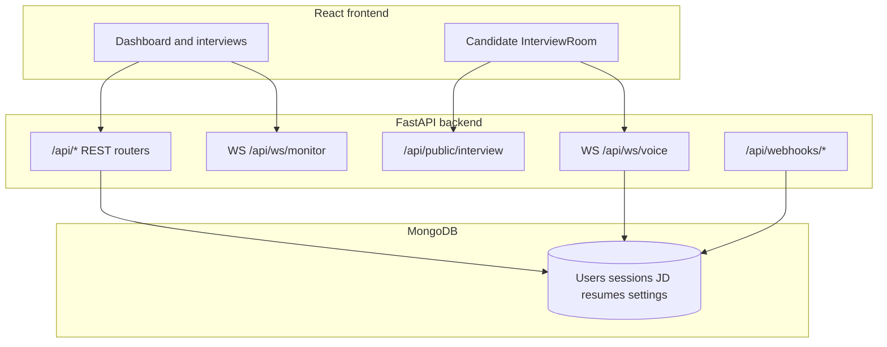

<div align="center">

# Phonic AI Interview Agent

**AI-assisted phone and browser interviews** — structured voice sessions using job description and resume context, with evaluation reports.

[](https://opensource.org/licenses/Apache-2.0)
[](https://python.org)
[](https://nodejs.org)
[](https://reactjs.org)
[](https://fastapi.tiangolo.com)
[](https://mongodb.com)

[Features](#features) · [Quick start](#quick-start) · [Configuration](#configuration) · [API reference](#api-reference)

---

</div>

## Table of contents

- [Overview](#overview)
- [Features](#features)
- [Architecture](#architecture)
- [Quick start](#quick-start)
- [Configuration](#configuration)
- [Telephony](#telephony)
- [Usage](#usage)
- [Project structure](#project-structure)
- [API reference](#api-reference)
- [Development](#development)
- [Contributing](#contributing)
- [License](#license)
- [Acknowledgments](#acknowledgments)

## Overview

Phonic is a full-stack platform for running technical interviews:

- **Recruiter dashboard** (React): create sessions, manage job descriptions, view live transcripts and evaluation reports.
- **Candidate room** (public route): browser interview at `/interview/{session_id}` using the voice WebSocket and `GET /api/public/interview/{session_id}` for session metadata (no login).
- **Voice pipeline** (FastAPI + Pipecat): Deepgram STT, Cartesia TTS, and Silero VAD when keys are configured; **text fallback** when they are not.
- **LLMs**: Ollama (default), Anthropic Claude, or OpenAI — selectable per session and in app settings.
- **Persistence**: MongoDB for users, interview sessions, JD templates, resumes, and **app settings** (API keys from the Settings UI are stored in MongoDB, with `.env` as bootstrap defaults).

Product notes live in [memory/PRD.md](memory/PRD.md). UI tokens are summarized in [design_guidelines.json](design_guidelines.json).

## Features

| Area | Details |
|------|---------|
| LLM | Ollama, Claude, or OpenAI via `LLM_PROVIDER` / settings |
| Voice | Pipecat pipeline with Deepgram + Cartesia when configured |
| Telephony | Ozonetel outbound dial from API; Telnyx / Exotel / Ozonetel **webhooks** for call lifecycle |
| Content | JD parse/save/library, resume upload (PDF/DOCX/DOC/TXT) and text parse |
| Evaluation | Async post-interview evaluation; `GET` / `POST …/run` |
| Auth | JWT (python-jose + bcrypt); demo user seeded on startup |

## Architecture



## Quick start

### Prerequisites

- Python **3.11+**
- Node.js **18+**
- **MongoDB** (local or Atlas)
- **[uv](https://docs.astral.sh/uv/getting-started/installation/)** for the backend

### Clone and run

```bash
git clone git@github.com:sayantan007pal/Phonic-AI-Interview-Agent.git
cd Phonic-AI-Interview-Agent

# Backend
cd backend
cp .env.example .env
# Edit .env — at minimum MONGO_URL, DB_NAME, SECRET_KEY
uv sync
uv run uvicorn server:app --reload --host 0.0.0.0 --port 8000
```

In a second terminal:

```bash
cd Phonic-AI-Interview-Agent/frontend
npm install
echo "REACT_APP_BACKEND_URL=http://localhost:8000" > .env
npm start
```

- **API**: [http://localhost:8000](http://localhost:8000) — OpenAPI at `/docs`
- **App**: [http://localhost:3000](http://localhost:3000)

**Demo login** (seeded on API startup if missing): `admin@phonic.ai` / `phonic123`

**Candidate link** (after creating an interview): `http://localhost:3000/interview/<session_id>` where `<session_id>` is the UUID returned from `POST /api/interviews`.

## Configuration

Copy [backend/.env.example](backend/.env.example) to `backend/.env`. Variables below mirror that file.

### Required for a minimal API boot

| Variable | Purpose |
|----------|---------|
| `MONGO_URL` | MongoDB connection string |
| `DB_NAME` | Database name |
| `SECRET_KEY` | JWT signing secret (change in production) |

### URLs and environment

| Variable | Purpose |
|----------|---------|
| `ENVIRONMENT` | e.g. `development` |
| `APP_BASE_URL` | Frontend origin (e.g. `http://localhost:3000`) |
| `BACKEND_URL` | Public API base URL |

### LLM

| Variable | Purpose |
|----------|---------|
| `LLM_PROVIDER` | `ollama`, `claude`, or `openai` |
| `OLLAMA_BASE_URL` / `OLLAMA_MODEL` | Local Ollama |
| `ANTHROPIC_API_KEY` | Claude |
| `OPENAI_API_KEY` / `OPENAI_MODEL` | OpenAI |

### Voice (Pipecat)

| Variable | Purpose |
|----------|---------|
| `DEEPGRAM_API_KEY` | Speech-to-text |
| `CARTESIA_API_KEY` | Text-to-speech |
| `CARTESIA_CUSTOM_VOICE_ID` | Optional custom Cartesia voice |

### Telephony

| Variable | Purpose |
|----------|---------|
| **Ozonetel** | `OZONETEL_API_KEY`, `OZONETEL_API_URL`, `OZONETEL_CAMPAIGN_NAME`, `OZONETEL_USERNAME`, `OZONETEL_CALLBACK_URL` |
| **Telnyx** | `TELNYX_API_KEY`, `TELNYX_PUBLIC_KEY`, `TELNYX_CONNECTION_ID_DEFAULT`, `TELNYX_DID_US`, `TELNYX_DID_UK`, `TELNYX_DID_AU`, `TELNYX_DID_CA` |
| **Exotel** | `EXOTEL_API_KEY`, `EXOTEL_API_TOKEN`, `EXOTEL_SID`, `EXOTEL_VIRTUAL_NUMBER` |
| `INDIA_TELEPHONY_PROVIDER` | e.g. `ozonetel` (see `.env.example`) |

### Optional integrations

| Variable | Purpose |
|----------|---------|
| **LiveKit** | `LIVEKIT_URL`, `LIVEKIT_API_KEY`, `LIVEKIT_API_SECRET` |
| **AWS** | `AWS_ACCESS_KEY_ID`, `AWS_SECRET_ACCESS_KEY`, `AWS_REGION`, `S3_BUCKET_NAME`, `SQS_EVALUATION_QUEUE_URL` |

**Settings UI**: The dashboard **Settings** page reads/updates the `app_settings` document in MongoDB. Masked keys are shown in the API; new values overwrite stored settings. Environment variables still apply for first-run defaults and for fields not yet saved in the database.

## Telephony

- **Outbound dial from the API**: `POST /api/interviews/{session_id}/call` is implemented for **Ozonetel** and requires Ozonetel env vars to be set.
- **Webhooks** (for provider callbacks regardless of who placed the call): `POST /api/webhooks/telnyx`, `POST /api/webhooks/exotel`, `POST /api/webhooks/ozonetel` — see [backend/routers/webhooks.py](backend/routers/webhooks.py).

Telnyx-specific outbound dialing is not implemented in the same router path as Ozonetel; use webhooks and your Telnyx call-control integration as needed.

## Usage

1. Log in (or register) at `/login`.
2. Create an interview under **Interviews → New** with candidate fields, JD text or template, optional resume, accent, duration, and LLM choice.
3. Share the candidate URL: `{frontend_origin}/interview/{session_id}`.
4. For **phone** mode with Ozonetel configured, trigger a call:

```bash
curl -X POST "http://localhost:8000/api/interviews/<session_id>/call" \
  -H "Authorization: Bearer <access_token>"
```

5. Run evaluation after a transcript exists: `POST /api/evaluations/<session_id>/run`, then open the report in the UI.

## Project structure

```
Phonic-AI-Interview-Agent/
├── backend/
│   ├── db/mongo.py
│   ├── models/interview_session.py
│   ├── pipeline/interview_pipeline.py
│   ├── routers/
│   │   ├── auth.py
│   │   ├── interviews.py
│   │   ├── jd.py
│   │   ├── resume.py
│   │   ├── evaluations.py
│   │   ├── settings.py
│   │   └── webhooks.py
│   ├── services/
│   │   ├── llm_provider.py
│   │   ├── prompt_builder.py
│   │   ├── conversation_state.py
│   │   ├── evaluation.py
│   │   ├── jd_parser.py
│   │   ├── resume_parser.py
│   │   └── cartesia_voices.py
│   ├── tests/test_phonic_api.py
│   ├── server.py
│   ├── pyproject.toml
│   ├── .env.example
│   └── requirements.txt
├── frontend/
│   ├── public/
│   ├── src/
│   │   ├── components/Layout.js
│   │   ├── contexts/AuthContext.js
│   │   ├── contexts/ThemeContext.js
│   │   ├── lib/api.js
│   │   ├── lib/ws.js
│   │   ├── pages/
│   │   │   ├── Dashboard.js
│   │   │   ├── Login.js
│   │   │   ├── InterviewsList.js
│   │   │   ├── NewInterview.js
│   │   │   ├── InterviewDetail.js
│   │   │   ├── InterviewRoom.js
│   │   │   ├── EvaluationReport.js
│   │   │   ├── JDLibrary.js
│   │   │   └── Settings.js
│   │   ├── App.js
│   │   └── index.js
│   └── package.json
├── memory/PRD.md
├── design_guidelines.json
├── LICENSE
└── README.md
```

## API reference

Base path: `/api`. Authenticated routes expect `Authorization: Bearer <token>` from `POST /api/auth/login`.

### Auth

| Method | Path | Description |
|--------|------|-------------|
| POST | `/api/auth/register` | Register (JSON: `email`, `password`, `name`, optional `role`) |
| POST | `/api/auth/login` | Login (JSON: `email`, `password`) → `access_token` |
| GET | `/api/auth/me` | Current user |

### Interviews

| Method | Path | Description |
|--------|------|-------------|
| GET | `/api/interviews` | List sessions (`status`, `skip`, `limit`) |
| POST | `/api/interviews` | Create session |
| GET | `/api/interviews/stats` | Aggregate stats |
| GET | `/api/interviews/{session_id}` | Session detail |
| POST | `/api/interviews/{session_id}/call` | Trigger Ozonetel call |
| POST | `/api/interviews/{session_id}/cancel` | Cancel session |
| GET | `/api/interviews/{session_id}/transcript` | Get transcript |
| POST | `/api/interviews/{session_id}/transcript` | Append transcript turn |

### Job descriptions

| Method | Path | Description |
|--------|------|-------------|
| POST | `/api/jd/parse` | Parse JD text |
| POST | `/api/jd/upload` | Upload file as JD |
| POST | `/api/jd/save` | Save template |
| GET | `/api/jd` | List templates |
| DELETE | `/api/jd/{jd_id}` | Delete template |

### Resume

| Method | Path | Description |
|--------|------|-------------|
| POST | `/api/resume/upload` | Upload PDF/DOCX/DOC/TXT |
| POST | `/api/resume/parse-text` | Parse inline text JSON `{ "text": "..." }` |
| GET | `/api/resume/{resume_id}` | Fetch stored resume |

### Evaluations

| Method | Path | Description |
|--------|------|-------------|
| GET | `/api/evaluations/{session_id}` | Evaluation + transcript snapshot |
| POST | `/api/evaluations/{session_id}/run` | Queue evaluation job |

### Settings

| Method | Path | Description |
|--------|------|-------------|
| GET | `/api/settings` | Get settings (masked secrets) |
| PATCH | `/api/settings` | Partial update |
| POST | `/api/settings/test-llm` | Smoke-test LLM |

### Webhooks

| Method | Path | Description |
|--------|------|-------------|
| POST | `/api/webhooks/telnyx` | Telnyx events |
| POST | `/api/webhooks/exotel` | Exotel events |
| POST | `/api/webhooks/ozonetel` | Ozonetel CDR / callback |

### Public and health

| Method | Path | Description |
|--------|------|-------------|
| GET | `/api/health` | Liveness |
| GET | `/api/public/interview/{session_id}` | Limited session info (no auth) |

### WebSockets

| Path | Description |
|------|-------------|
| `/api/ws/voice/{session_id}` | Voice / interview pipeline |
| `/api/ws/monitor/{session_id}` | Recruiter monitor (transcript snapshot + keepalive) |

## Frontend environment

| Variable | Description |
|----------|-------------|
| `REACT_APP_BACKEND_URL` | API origin (e.g. `http://localhost:8000`). Used by [frontend/src/lib/api.js](frontend/src/lib/api.js) and [frontend/src/pages/InterviewRoom.js](frontend/src/pages/InterviewRoom.js). |
| `REACT_APP_LOGIN_BG` | Optional background image URL for the login page. |

## Development

Install backend dependencies including the dev group (pytest + **requests** used by integration tests):

```bash
cd backend
uv sync --group dev
```

Integration tests in [backend/tests/test_phonic_api.py](backend/tests/test_phonic_api.py) call a **running** API. Start MongoDB and the server, then point the suite at the server base URL (the tests read `REACT_APP_BACKEND_URL` for historical reasons):

```bash
export REACT_APP_BACKEND_URL=http://localhost:8000
uv run pytest
```

Black, isort, and Flake8 are **not** configured in this repository; add your own formatter/linter if you standardize on them.

## Contributing

Issues and pull requests are welcome. For larger changes, open an issue first so direction aligns with [memory/PRD.md](memory/PRD.md).

## License

This project is licensed under the [Apache License 2.0](LICENSE). See the license file for the full text and copyright notice template.

## Acknowledgments

- [Pipecat](https://github.com/pipecat-ai/pipecat)
- [Deepgram](https://deepgram.com/)
- [Cartesia](https://cartesia.ai/)
- [Ollama](https://ollama.ai/)
- [FastAPI](https://fastapi.tiangolo.com/)
- [Radix UI](https://radix-ui.com/)
- [Tailwind CSS](https://tailwindcss.com/)
